# Arquitetura Detalhada — Claro Anypoint (Vibes Edition)

## 📊 Diagrama da Arquitetura Completa

```mermaid
flowchart TD
    %% ─────────────────────────────────────────
    %% CONSUMERS
    %% ─────────────────────────────────────────
    subgraph CONSUMERS["👥 Consumidores"]
        BSS["BSS / CRM Legados\nSOAP 1.1"]
        DIGITAL["Apps Digitais\nREST / JSON"]
        INT["Sistemas Internos\nAuto · WRH · FCD · Watson"]
    end

    %% ─────────────────────────────────────────
    %% EXPERIENCE LAYER
    %% ─────────────────────────────────────────
    subgraph EXPERIENCE["⚡ Experience Layer"]
        XAPI["conta-experience-api\n━━━━━━━━━━━━━━━━━━━━━\nSOAP 1.1 APIkit ← WSDL original\nREST OAS 3.0 ← TMF666 · TMF629\nValidação · Correlação · ACK"]
    end

    %% ─────────────────────────────────────────
    %% PROCESS LAYER
    %% ─────────────────────────────────────────
    subgraph PROCESS["⚙️ Process Layer"]
        PAPI["conta-process-api\n━━━━━━━━━━━━━━━━━━━━━\nSubscriber Anypoint MQ\nValidate & Route\nScatter-Gather Fan-out\nackMode=MANUAL · ObjectStore"]
    end

    %% ─────────────────────────────────────────
    %% ANYPOINT MQ — BROKER
    %% ─────────────────────────────────────────
    subgraph BROKER["📨 Anypoint MQ — Broker"]
        subgraph BIZ["Filas de Negócio"]
            MQ_ORQ[("conta-criar-conta-orq\nPersistent · DLQ")]
            MQ_CLE[("conta-criar-conta-cle-out\nPersistent · DLQ")]
            MQ_SF[("conta-criar-conta-sf\nPersistent · DLQ")]
            MQ_PAR[("conta-criar-conta-parallels\nPersistent · DLQ")]
        end
        subgraph INFRA["Filas de Infraestrutura"]
            MQ_LOG[("conta-log\nAsync Audit")]
            MQ_ERRC[("conta-err-cadastrar\nNovo Erro")]
            MQ_ERRP[("conta-err-persistir\nHospital / DLQ")]
        end
    end

    %% ─────────────────────────────────────────
    %% SYSTEM LAYER
    %% ─────────────────────────────────────────
    subgraph SYSTEM["🔧 System Layer — SAPIs"]
        TMF666["tmf666-account-management-sapi\n━━━━━━━━━━━━━━━━━━━━━\nTMF666 BillingAccount\nPOST · GET · PATCH /billingAccount\nSubscriber MQ · Java CLE · SF · Parallels\nSiebel · ICMS · WRH"]
        TMF629["tmf629-customer-management-sapi\n━━━━━━━━━━━━━━━━━━━━━\nTMF629 Customer\nPOST · GET · PATCH /customer\nJava CLE · Watson"]
        TMF632["tmf632-party-management-sapi\n━━━━━━━━━━━━━━━━━━━━━\nTMF632 Party\nGET /individual/{id}\nGET /organization/{id}\nSiebel DB"]
        TMF673["tmf673-geographic-address-sapi\n━━━━━━━━━━━━━━━━━━━━━\nTMF673 Geographic Address\nGET · POST /geographicAddress\nParallels HTTP"]
        ERR_SVC["conta-error-service\n━━━━━━━━━━━━━━━━━━━━━\nSubscriber MQ\nCatálogo Oracle\nRetry · DLQ · Suspend"]
        LOG_SVC["conta-log-service\n━━━━━━━━━━━━━━━━━━━━━\nSubscriber MQ\nGravação Oracle\nAuditoria · Stage Codes"]
    end

    %% ─────────────────────────────────────────
    %% BACKEND SYSTEMS
    %% ─────────────────────────────────────────
    subgraph BACKENDS["🏢 Sistemas Backend Legado"]
        CLE["CLE\nJava Module\nclecn600.jar\nClecn600Facade"]
        SALESFORCE["Salesforce\nConnector SOAP\nenterprise.wsdl"]
        PARALLELS["Parallels\nHTTP / WSDL\nTLS mútuo"]
        SIEBEL["Siebel CRM\nJDBC Oracle"]
        ICMS["ICMS\nJDBC Oracle"]
        WRH["WRH\nHTTP"]
        WATSON["Watson\nHTTP"]
    end

    %% ─────────────────────────────────────────
    %% DATABASES
    %% ─────────────────────────────────────────
    subgraph DATABASES["🗄️ Databases Oracle"]
        ORA_LOG[("Oracle\nLog · Audit")]
        ORA_ERR[("Oracle\nTIPO_ERRO\nCONFIG_TIPO_ERRO")]
    end

    %% ═══════════════════════════════════════════
    %% FLUXO PRINCIPAL — Entrada
    %% ═══════════════════════════════════════════
    BSS -- "SOAP 1.1\nCriarContaCliente\nupdateCustomerBillingAccount\ncustomerBillingAccountQuery" --> XAPI
    DIGITAL -- "REST JSON\nTMF666 · TMF629\nbillingAccount · customer" --> XAPI
    INT -- "SOAP / REST\nqueryCustomerById\nqueryDebitBillingAccount\nqueryBillingAccountLog" --> XAPI

    %% ═══════════════════════════════════════════
    %% EXPERIENCE → BROKER (async fire-and-forget)
    %% ═══════════════════════════════════════════
    XAPI -. "publish\nconta-criar-conta-orq\nPriority=4 · Persistent" .-> MQ_ORQ
    XAPI -- "ACK Síncrono\ncod_retorno + des_msg" --> BSS

    %% ═══════════════════════════════════════════
    %% EXPERIENCE → SAPIs (sync HTTP — operações query)
    %% ═══════════════════════════════════════════
    XAPI -- "HTTP\nqueryCustomer\nqueryCustomerById" --> TMF629
    XAPI -- "HTTP\nparty data\nindividual · organization" --> TMF632
    XAPI -- "HTTP\ngeographicAddress\nCEP · CNL · IBGE" --> TMF673

    %% ═══════════════════════════════════════════
    %% BROKER → PROCESS
    %% ═══════════════════════════════════════════
    MQ_ORQ -. "subscribe\nackMode=MANUAL\nCheckpoint → ObjectStore" .-> PAPI

    %% ══════════���════════════════════════════════
    %% PROCESS → BROKER (Scatter-Gather fan-out)
    %% ═══════════════════════════════════════════
    PAPI -. "publish\nfan-out CLE" .-> MQ_CLE
    PAPI -. "publish\nfan-out Salesforce" .-> MQ_SF
    PAPI -. "publish\nfan-out Parallels" .-> MQ_PAR

    %% ═══════════════════════════════════════════
    %% BROKER → TMF666 (System Subscribers)
    %% ═══════════════════════════════════════════
    MQ_CLE -. "subscribe\nackMode=MANUAL" .-> TMF666
    MQ_SF -. "subscribe\nackMode=MANUAL" .-> TMF666
    MQ_PAR -. "subscribe\nackMode=MANUAL" .-> TMF666

    %% ═══════════════════════════════════════════
    %% TMF666 → Backends
    %% ═══════════════════════════════════════════
    TMF666 -- "java:invoke-static\nclecn600.jar" --> CLE
    TMF666 -- "Salesforce Connector\nSOAP enterprise WSDL" --> SALESFORCE
    TMF666 -- "HTTP Request\nWSDL · TLS mútuo" --> PARALLELS
    TMF666 -- "DB Connector\nJDBC Oracle" --> SIEBEL
    TMF666 -- "DB Connector\nJDBC Oracle" --> ICMS
    TMF666 -- "HTTP Request" --> WRH

    %% ═══════════════════════════════════════════
    %% TMF629 · TMF632 · TMF673 → Backends
    %% ═══════════════════════════════════════════
    TMF629 -- "java:invoke-static\nclecn600.jar" --> CLE
    TMF629 -- "HTTP Request" --> WATSON
    TMF632 -- "DB Connector\nJDBC Oracle" --> SIEBEL
    TMF673 -- "HTTP Request\nHTTP/WSDL" --> PARALLELS

    %% ═══════════════════════════════════════════
    %% LOG (publish assíncrono de todas as camadas)
    %% ═══════════════════════════════════════════
    XAPI -. "publish\nconta-log" .-> MQ_LOG
    PAPI -. "publish\nconta-log" .-> MQ_LOG
    TMF666 -. "publish\nconta-log" .-> MQ_LOG
    TMF629 -. "publish\nconta-log" .-> MQ_LOG
    MQ_LOG -. "subscribe" .-> LOG_SVC
    LOG_SVC --> ORA_LOG

    %% ═══════════════════════════════════════════
    %% ERROR HANDLING
    %% ═══════════════════════════════════════════
    PAPI -. "publish\nerro não catalogado" .-> MQ_ERRC
    TMF666 -. "publish\nerro de negócio/técnico" .-> MQ_ERRC
    MQ_ERRC -. "subscribe\nGlobal Error Handler" .-> ERR_SVC
    ERR_SVC -. "retry esgotado\nhospital de erros" .-> MQ_ERRP
    ERR_SVC --> ORA_ERR

    %% ═══════════════════════════════════════════
    %% ESTILOS
    %% ═══════════════════════════════════════════
    classDef consumer fill:#C0392B,stroke:#922B21,color:#fff,rx:8
    classDef experience fill:#2980B9,stroke:#1A5276,color:#fff,rx:8
    classDef process fill:#7D3C98,stroke:#512E5F,color:#fff,rx:8
    classDef system fill:#1E8449,stroke:#145A32,color:#fff,rx:8
    classDef broker fill:#D68910,stroke:#9A6209,color:#fff
    classDef backend fill:#616A6B,stroke:#424949,color:#fff,rx:4
    classDef database fill:#148F77,stroke:#0E6655,color:#fff

    class BSS,DIGITAL,INT consumer
    class XAPI experience
    class PAPI process
    class TMF666,TMF629,TMF632,TMF673,ERR_SVC,LOG_SVC system
    class MQ_ORQ,MQ_CLE,MQ_SF,MQ_PAR,MQ_LOG,MQ_ERRC,MQ_ERRP broker
    class CLE,SALESFORCE,PARALLELS,SIEBEL,ICMS,WRH,WATSON backend
    class ORA_LOG,ORA_ERR database
```



---

## 🏗️ Arquitetura em Camadas

### 👥 **Consumidores**

| Sistema | Protocolo | Endpoints Exemplo |
|---------|-----------|-------------------|
| **BSS / CRM Legados** | SOAP 1.1 | `CriarContaCliente`, `updateCustomerBillingAccount`, `customerBillingAccountQuery` |
| **Apps Digitais** | REST / JSON | `POST /billingAccount`, `GET /customer/{id}`, `PATCH /billingAccount/{id}` |
| **Sistemas Internos** | SOAP / REST | `queryCustomerById`, `queryDebitBillingAccount`, `queryBillingAccountLog` |

---

## ⚡ **Experience Layer**

### `conta-experience-api`

Ponto de entrada único que:

1. **Recebe requisições** de múltiplos consumidores (SOAP/REST)
2. **Valida** a correlação (ID único por requisição)
3. **Normaliza** para TMF 629 / TMF 666
4. **Roteia async** para o broker (fire-and-forget)
5. **Retorna ACK síncrono** ao consumidor (cod_retorno + des_msg)

#### Capacidades:

- **SOAP 1.1 APIkit** ← Compatibilidade com WSDL original dos legados
- **REST OpenAPI 3.0** ← TMF 629 (Customer), TMF 666 (BillingAccount)
- **Validação** de campos obrigatórios
- **Correlação** (tracing distribuído)
- **Async Publishing** para MQ com prioridade

#### Endpoints Principais:

```xml
<!-- SOAP -->
POST /CriarContaCliente
POST /updateCustomerBillingAccount
POST /customerBillingAccountQuery

<!-- REST TMF666 -->
POST /billingAccount
GET  /billingAccount/{id}
PATCH /billingAccount/{id}

<!-- REST TMF629 -->
POST /customer
GET  /customer/{id}
PATCH /customer/{id}
```

---

## ⚙️ **Process Layer**

### `conta-process-api`

Orquestra a criação de conta com **scatter-gather fan-out**:

1. **Subscribe** em `conta-criar-conta-orq` (Anypoint MQ)
2. **Validação** de regras de negócio
3. **Enriquecimento** de dados (De-Para, lookups)
4. **Fan-out** em paralelo:
   - `conta-criar-conta-cle-out` → CLE System API
   - `conta-criar-conta-sf-out` → Salesforce System API
   - `conta-criar-conta-parallels-out` → Parallels System API
5. **Logging** assíncrono em `conta-log`
6. **Error Handling** → `conta-err-cadastrar` (novo erro) / `conta-err-persistir` (hospital)

#### Configuração Anypoint MQ:

- **ackMode:** MANUAL (confirmação explícita após sucesso)
- **ObjectStore:** Checkpoint de mensagens processadas
- **Dead Letter Queue (DLQ):** Retenção de erros

---

## 📨 **Anypoint MQ — Broker**

### Filas de Negócio

| Fila | Tipo | Propósito |
|------|------|----------|
| `conta-criar-conta-orq` | Persistent + DLQ | Input da orquestração (entrada do Process) |
| `conta-criar-conta-cle-out` | Persistent + DLQ | Fan-out para CLE System API |
| `conta-criar-conta-sf-out` | Persistent + DLQ | Fan-out para Salesforce System API |
| `conta-criar-conta-parallels-out` | Persistent + DLQ | Fan-out para Parallels System API |

### Filas de Infraestrutura

| Fila | Tipo | Propósito |
|------|------|----------|
| `conta-log` | Async Audit | Logs de auditoria (todas as camadas) |
| `conta-err-cadastrar` | New Error | Erros não catalogados (novo tipo de erro) |
| `conta-err-persistir` | Hospital / DLQ | Hospital de erros após retry esgotado |

---

## 🔧 **System Layer — SAPIs (System APIs)**

### 1️⃣ **`tmf666-account-management-sapi`**

**Responsabilidade:** Gestão de contas de faturamento (TMF 666)

- **Tipo:** System API
- **Subscriber:** Filas `conta-criar-conta-cle-out`, `conta-criar-conta-sf-out`, `conta-criar-conta-parallels-out`
- **ackMode:** MANUAL
- **Endpoints:** `POST /billingAccount`, `GET /billingAccount/{id}`, `PATCH /billingAccount/{id}`

**Conectores:**

| Backend | Tipo | Responsabilidade |
|---------|------|-----------------|
| **CLE** | java:invoke-static clecn600.jar | Provisioning de conta |
| **Salesforce** | Salesforce Connector (SOAP) | Sync de conta + contato |
| **Parallels** | HTTP / WSDL | Confirmação via Parallels |
| **Siebel CRM** | JDBC Oracle | Lookup de cliente |
| **ICMS** | JDBC Oracle | Log de faturamento |
| **WRH** | HTTP | Sync de dados administrativos |

---

### 2️⃣ **`tmf629-customer-management-sapi`**

**Responsabilidade:** Gestão de clientes (TMF 629)

- **Tipo:** System API
- **Endpoints:** `POST /customer`, `GET /customer/{id}`, `PATCH /customer/{id}`
- **Conectores:**
  - **CLE** (java:invoke-static) → Provisioning
  - **Watson** (HTTP) → Enriquecimento de dados

---

### 3️⃣ **`tmf632-party-management-sapi`**

**Responsabilidade:** Gestão de partes (indivíduos e organizações)

- **Tipo:** System API
- **Endpoints:** `GET /individual/{id}`, `GET /organization/{id}`
- **Conectores:**
  - **Siebel CRM** (JDBC Oracle) → Dados de cliente

---

### 4️⃣ **`tmf673-geographic-address-sapi`**

**Responsabilidade:** Gestão de endereços geográficos

- **Tipo:** System API
- **Endpoints:** `GET /geographicAddress`, `POST /geographicAddress`
- **Conectores:**
  - **Parallels** (HTTP / WSDL) → Validação de CEP, CNL, IBGE

---

### 5️⃣ **`conta-error-service`**

**Responsabilidade:** Tratamento centralizado de erros

- **Type:** System API (Error Handler)
- **Subscriber:** `conta-err-cadastrar`
- **Lógica:**
  1. Consulta catálogo de erros (Oracle `TIPO_ERRO`)
  2. **Retry** se configurado
  3. Se esgotado → publica em `conta-err-persistir` (hospital)
  4. Registra em `CONFIG_TIPO_ERRO` (audit trail)
  5. Notifica operações

---

### 6️⃣ **`conta-log-service`**

**Responsabilidade:** Auditoria centralizada

- **Type:** System API (Log Handler)
- **Subscriber:** `conta-log`
- **Lógica:**
  1. Recebe eventos de todas as camadas
  2. Enriquece com timestamp, correlation-id, stage codes
  3. Persiste em Oracle (tabela `LOG_AUDITORIA`)
  4. Alimenta dashboards de monitoramento

---

## 🏢 **Backend Systems**

| Sistema | Tecnologia | Protocolo | Responsabilidade |
|---------|-----------|----------|-----------------|
| **CLE** | Java Module | java:invoke-static | Provisioning de conta (core legacy) |
| **Salesforce** | Connector SOAP | SOAP 1.1 | Sync CRM (customer + account) |
| **Parallels** | HTTP / WSDL | HTTP + TLS mútuo | Confirmação de criação |
| **Siebel CRM** | Database | JDBC Oracle | Lookup de cliente + dados CRM |
| **ICMS** | Database | JDBC Oracle | Log de faturamento |
| **WRH** | API HTTP | HTTP | Sync de dados administrativos |
| **Watson** | API HTTP | HTTP | Enriquecimento de dados (IA) |

---

## 🗄️ **Databases Oracle**

### Tabelas Críticas:

| Tabela | Propósito |
|--------|----------|
| `LOG_AUDITORIA` | Audit trail centralizado |
| `TIPO_ERRO` | Catálogo de tipos de erro (configurável) |
| `CONFIG_TIPO_ERRO` | Configuração de retry + notificação |

---

## 🔄 **Fluxos Principais**

### Cenário 1: Criar Conta (CriarContaCliente)

```
1. Cliente SOAP (BSS/CRM) envia:
   POST /CriarContaCliente (SOAP 1.1)
   
2. Experience API:
   - Valida correlação
   - Normaliza para TMF 666
   - Retorna 200 OK (ACK síncrono)
   
3. Experience publica async em:
   conta-criar-conta-orq (Priority=4, Persistent)
   
4. Process API:
   - Subscribe em conta-criar-conta-orq
   - Validação + enriquecimento
   - Fan-out em paralelo:
     • conta-criar-conta-cle-out
     • conta-criar-conta-sf-out
     • conta-criar-conta-parallels-out
   - Publica em conta-log
   
5. System APIs (Subscribers):
   - TMF666 (CLE) → java:invoke-static clecn600.jar
   - TMF666 (Salesforce) → Salesforce Connector
   - TMF666 (Parallels) → HTTP Request + TLS mútuo
   
6. Logging:
   - Todos os eventos → conta-log
   - Log Service → Oracle LOG_AUDITORIA
   
7. Error Handling:
   - Se erro → conta-err-cadastrar
   - Error Service → retry (se configurado) ou DLQ
```

### Cenário 2: Query de Cliente (customerBillingAccountQuery)

```
1. Cliente SOAP envia:
   POST /customerBillingAccountQuery (SOAP 1.1)
   
2. Experience API:
   - Valida parametrização
   - **Sync HTTP call** para TMF632 (party data)
   - TMF632 → JDBC Siebel (lookup cliente)
   - Retorna dados para Experience
   
3. Experience retorna dados (SOAP) ao cliente
   (Sem publicar em MQ — operação síncrona)
```

### Cenário 3: Error Handling

```
1. Qualquer camada detecta erro:
   - Process API → publica conta-err-cadastrar
   - TMF666 → publica conta-err-cadastrar
   
2. Error Service (subscriber):
   - Consulta TIPO_ERRO (Oracle)
   - Se retry < max_retries:
     → republica em conta-criar-conta-orq (delayed)
   - Se retry esgotado:
     → publica em conta-err-persistir (hospital)
     → registra em CONFIG_TIPO_ERRO (audit)
     → notifica operações
```

---

## 📊 **Matriz de Decisão**

| Componente | Tecnologia | Justificativa |
|-----------|-----------|--------------|
| **Messaging** | Anypoint MQ | HA, Persistent, DLQ nativo, integração MuleSoft |
| **SOAP Legacy** | APIkit SOAP | Compatibilidade 100% com WSDL original |
| **REST Moderno** | OpenAPI 3.0 + TMF | Padrão industry, tooling, documentação automática |
| **CLE Integration** | java:invoke-static | Performance crítica, legacy Java libs |
| **Error Catalog** | Oracle TIPO_ERRO | Configurável, auditável, sem deploy |
| **Logging Centralizado** | conta-log (MQ) | Async, escalável, não bloqueia fluxos |

---

## 🚀 **Próximos Passos**

- [ ] Criar repositório `conta-experience-api` (MuleSoft + APIkit SOAP + REST)
- [ ] Criar repositório `conta-process-api` (Scatter-Gather)
- [ ] Criar repositórios das 6 SAPIs (TMF666, TMF629, TMF632, TMF673, Error, Log)
- [ ] Configurar Anypoint MQ (filas + DLQ + políticas)
- [ ] Implementar Object Store v2 (checkpoint + De-Para cache)
- [ ] Testar end-to-end (from SOAP legacy to Salesforce)
- [ ] Documentar TMF 666 / 629 field mapping (BW ↔ TMF)
- [ ] Setup Anypoint Monitoring (dashboards + alertas)

---

## 📝 **Glossário**

| Termo | Definição |
|-------|-----------|
| **SAPI** | System API (conecta a um sistema backend) |
| **TMF** | TM Forum (padrão de APIs de telecomunicações) |
| **Fan-out** | Envio de uma mensagem para múltiplos subscribers |
| **Scatter-Gather** | Padrão de integração: envia em paralelo + aguarda todas as respostas |
| **ACK** | Acknowledgement (confirmação de recebimento) |
| **ackMode=MANUAL** | Confirmação manual (após processar com sucesso) |
| **DLQ** | Dead Letter Queue (fila de erro) |
| **Persistent** | Mensagem persistida em disco (não é perdida em crash) |
| **Correlation ID** | ID único para rastrear uma transação |
| **Object Store v2** | Cache distribuído Anypoint (substitui Shared Variables) |
