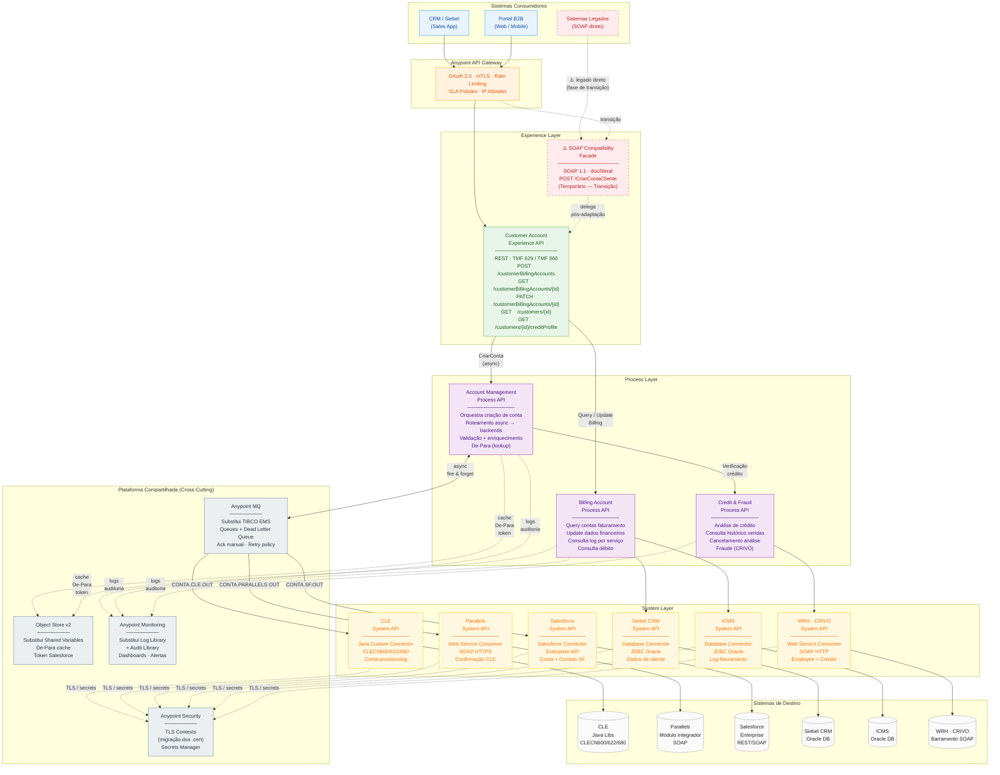

# Arquitetura de Integração - Claro TIBCO Migration

## Diagrama da Arquitetura

## Legenda de Cores

| Cor | Camada | Descrição |
|-----|--------|-----------|
| 🔵 Azul | **Consumidores** | Sistemas cliente / CRM Siebel |
| 🟠 Laranja | **API Gateway** | Anypoint Gateway com políticas de segurança |
| 🟢 Verde | **Experience Layer** | APIs de experiência (REST/SOAP) |
| 🟣 Roxo | **Process Layer** | APIs de processo com orquestração |
| 🟡 Amarelo | **System Layer** | Conectores para sistemas legados |
| ⚫ Cinza | **Plataforma Compartilhada** | MQ, Object Store, Monitoring, Security |
| ⚪ Branco | **Sistemas de Destino** | Backends (CLE, Parallels, Salesforce, etc.) |
| 🔴 Vermelho | **Legacy** | Componentes em transição (linhas tracejadas) |

## Componentes Principais

### Camada de Consumidores
- **CRM / Siebel (Sales App)** - Aplicação de vendas
- **Portal B2B** - Aplicações web e mobile
- **Sistemas Legados** - Integração SOAP direta (em transição)

### Anypoint API Gateway
- Autenticação OAuth 2.0 e mTLS
- Rate Limiting e SLA Policies
- IP Allowlist

### Experience Layer
- **Customer Account Experience API** - REST com padrão TMF 629/666
- **SOAP Compatibility Facade** - Compatibilidade com sistemas legados (transição)

### Process Layer
- **Account Management Process API** - Orquestra criação de conta
- **Billing Account Process API** - Query e update de contas de faturamento
- **Credit & Fraud Process API** - Análise de crédito e fraude

### System Layer
- CLE, Parallels, Salesforce, Siebel CRM, ICMS, WRH, CRIVO

### Plataforma Compartilhada
- **Anypoint MQ** - Substitui TIBCO EMS
- **Object Store v2** - Cache de De-Para e tokens
- **Anypoint Monitoring** - Logs e auditoria
- **Anypoint Security** - TLS e Secrets Manager
