```mermaid
flowchart TD
    %% ─────────────────────────────────────────
    %% CONSUMERS
    %% ─────────────────────────────────────────
    subgraph CONSUMERS["👥 Consumidores"]
        BSS["BSS / CRM Legados\nSOAP 1.1"]
        DIGITAL["Apps Digitais\nREST / JSON"]
        INT["Sistemas Internos\nAuto · WRH · FCD · Watson"]
    end

    %% ─────────────────────────────────────────
    %% EXPERIENCE LAYER
    %% ─────────────────────────────────────────
    subgraph EXPERIENCE["⚡ Experience Layer"]
        XAPI["conta-experience-api\n━━━━━━━━━━━━━━━━━━━━━\nSOAP 1.1 APIkit ← WSDL original\nREST OAS 3.0 ← TMF666 · TMF629\nValidação · Correlação · ACK"]
    end

    %% ─────────────────────────────────────────
    %% PROCESS LAYER
    %% ─────────────────────────────────────────
    subgraph PROCESS["⚙️ Process Layer"]
        PAPI["conta-process-api\n━━━━━━━━━━━━━━━━━━━━━\nSubscriber Anypoint MQ\nValidate & Route\nScatter-Gather Fan-out\nackMode=MANUAL · ObjectStore"]
    end

    %% ─────────────────────────────────────────
    %% ANYPOINT MQ — BROKER
    %% ─────────────────────────────────────────
    subgraph BROKER["📨 Anypoint MQ — Broker"]
        subgraph BIZ["Filas de Negócio"]
            MQ_ORQ[("conta-criar-conta-orq\nPersistent · DLQ")]
            MQ_CLE[("conta-criar-conta-cle-out\nPersistent · DLQ")]
            MQ_SF[("conta-criar-conta-sf\nPersistent · DLQ")]
            MQ_PAR[("conta-criar-conta-parallels\nPersistent · DLQ")]
        end
        subgraph INFRA["Filas de Infraestrutura"]
            MQ_LOG[("conta-log\nAsync Audit")]
            MQ_ERRC[("conta-err-cadastrar\nNovo Erro")]
            MQ_ERRP[("conta-err-persistir\nHospital / DLQ")]
        end
    end

    %% ─────────────────────────────────────────
    %% SYSTEM LAYER
    %% ─────────────────────────────────────────
    subgraph SYSTEM["🔧 System Layer — SAPIs"]
        TMF666["tmf666-account-management-sapi\n━━━━━━━━━━━━━━━━━━━━━\nTMF666 BillingAccount\nPOST · GET · PATCH /billingAccount\nSubscriber MQ · Java CLE · SF · Parallels\nSiebel · ICMS · WRH"]
        TMF629["tmf629-customer-management-sapi\n━━━━━━━━━━━━━━━━━━━━━\nTMF629 Customer\nPOST · GET · PATCH /customer\nJava CLE · Watson"]
        TMF632["tmf632-party-management-sapi\n━━━━━━━━━━━━━━━━━━━━━\nTMF632 Party\nGET /individual/{id}\nGET /organization/{id}\nSiebel DB"]
        TMF673["tmf673-geographic-address-sapi\n━━━━━━━━━━━━━━━━━━━━━\nTMF673 Geographic Address\nGET · POST /geographicAddress\nParallels HTTP"]
        ERR_SVC["conta-error-service\n━━━━━━━━━━━━━━━━━━━━━\nSubscriber MQ\nCatálogo Oracle\nRetry · DLQ · Suspend"]
        LOG_SVC["conta-log-service\n━━━━━━━━━━━━━━━━━━━━━\nSubscriber MQ\nGravação Oracle\nAuditoria · Stage Codes"]
    end

    %% ─────────────────────────────────────────
    %% BACKEND SYSTEMS
    %% ─────────────────────────────────────────
    subgraph BACKENDS["🏢 Sistemas Backend Legado"]
        CLE["CLE\nJava Module\nclecn600.jar\nClecn600Facade"]
        SALESFORCE["Salesforce\nConnector SOAP\nenterprise.wsdl"]
        PARALLELS["Parallels\nHTTP / WSDL\nTLS mútuo"]
        SIEBEL["Siebel CRM\nJDBC Oracle"]
        ICMS["ICMS\nJDBC Oracle"]
        WRH["WRH\nHTTP"]
        WATSON["Watson\nHTTP"]
    end

    %% ─────────────────────────────────────────
    %% DATABASES
    %% ─────────────────────────────────────────
    subgraph DATABASES["🗄️ Databases Oracle"]
        ORA_LOG[("Oracle\nLog · Audit")]
        ORA_ERR[("Oracle\nTIPO_ERRO\nCONFIG_TIPO_ERRO")]
    end

    %% ═══════════════════════════════════════════
    %% FLUXO PRINCIPAL — Entrada
    %% ═══════════════════════════════════════════
    BSS -- "SOAP 1.1\nCriarContaCliente\nupdateCustomerBillingAccount\ncustomerBillingAccountQuery" --> XAPI
    DIGITAL -- "REST JSON\nTMF666 · TMF629\nbillingAccount · customer" --> XAPI
    INT -- "SOAP / REST\nqueryCustomerById\nqueryDebitBillingAccount\nqueryBillingAccountLog" --> XAPI

    %% ═══════════════════════════════════════════
    %% EXPERIENCE → BROKER (async fire-and-forget)
    %% ═══════════════════════════════════════════
    XAPI -. "publish\nconta-criar-conta-orq\nPriority=4 · Persistent" .-> MQ_ORQ
    XAPI -- "ACK Síncrono\ncod_retorno + des_msg" --> BSS

    %% ═══════════════════════════════════════════
    %% EXPERIENCE → SAPIs (sync HTTP — operações query)
    %% ═══════════════════════════════════════════
    XAPI -- "HTTP\nqueryCustomer\nqueryCustomerById" --> TMF629
    XAPI -- "HTTP\nparty data\nindividual · organization" --> TMF632
    XAPI -- "HTTP\ngeographicAddress\nCEP · CNL · IBGE" --> TMF673

    %% ═══════════════════════════════════════════
    %% BROKER → PROCESS
    %% ═══════════════════════════════════════════
    MQ_ORQ -. "subscribe\nackMode=MANUAL\nCheckpoint → ObjectStore" .-> PAPI

    %% ═══════════════════════════════════════════
    %% PROCESS → BROKER (Scatter-Gather fan-out)
    %% ═══════════════════════════════════════════
    PAPI -. "publish\nfan-out CLE" .-> MQ_CLE
    PAPI -. "publish\nfan-out Salesforce" .-> MQ_SF
    PAPI -. "publish\nfan-out Parallels" .-> MQ_PAR

    %% ═══════════════════════════════════════════
    %% BROKER → TMF666 (System Subscribers)
    %% ═══════════════════════════════════════════
    MQ_CLE -. "subscribe\nackMode=MANUAL" .-> TMF666
    MQ_SF -. "subscribe\nackMode=MANUAL" .-> TMF666
    MQ_PAR -. "subscribe\nackMode=MANUAL" .-> TMF666

    %% ═══════════════════════════════════════════
    %% TMF666 → Backends
    %% ═══════════════════════════════════════════
    TMF666 -- "java:invoke-static\nclecn600.jar" --> CLE
    TMF666 -- "Salesforce Connector\nSOAP enterprise WSDL" --> SALESFORCE
    TMF666 -- "HTTP Request\nWSDL · TLS mútuo" --> PARALLELS
    TMF666 -- "DB Connector\nJDBC Oracle" --> SIEBEL
    TMF666 -- "DB Connector\nJDBC Oracle" --> ICMS
    TMF666 -- "HTTP Request" --> WRH

    %% ═══════════════════════════════════════════
    %% TMF629 · TMF632 · TMF673 → Backends
    %% ═══════════════════════════════════════════
    TMF629 -- "java:invoke-static\nclecn600.jar" --> CLE
    TMF629 -- "HTTP Request" --> WATSON
    TMF632 -- "DB Connector\nJDBC Oracle" --> SIEBEL
    TMF673 -- "HTTP Request\nHTTP/WSDL" --> PARALLELS

    %% ═══════════════════════════════════════════
    %% LOG (publish assíncrono de todas as camadas)
    %% ═══════════════════════════════════════════
    XAPI -. "publish\nconta-log" .-> MQ_LOG
    PAPI -. "publish\nconta-log" .-> MQ_LOG
    TMF666 -. "publish\nconta-log" .-> MQ_LOG
    TMF629 -. "publish\nconta-log" .-> MQ_LOG
    MQ_LOG -. "subscribe" .-> LOG_SVC
    LOG_SVC --> ORA_LOG

    %% ═══════════════════════════════════════════
    %% ERROR HANDLING
    %% ═══════════════════════════════════════════
    PAPI -. "publish\nerro não catalogado" .-> MQ_ERRC
    TMF666 -. "publish\nerro de negócio/técnico" .-> MQ_ERRC
    MQ_ERRC -. "subscribe\nGlobal Error Handler" .-> ERR_SVC
    ERR_SVC -. "retry esgotado\nhospital de erros" .-> MQ_ERRP
    ERR_SVC --> ORA_ERR

    %% ═══════════════════════════════════════════
    %% ESTILOS
    %% ═══════════════════════════════════════════
    classDef consumer fill:#C0392B,stroke:#922B21,color:#fff,rx:8
    classDef experience fill:#2980B9,stroke:#1A5276,color:#fff,rx:8
    classDef process fill:#7D3C98,stroke:#512E5F,color:#fff,rx:8
    classDef system fill:#1E8449,stroke:#145A32,color:#fff,rx:8
    classDef broker fill:#D68910,stroke:#9A6209,color:#fff
    classDef backend fill:#616A6B,stroke:#424949,color:#fff,rx:4
    classDef database fill:#148F77,stroke:#0E6655,color:#fff

    class BSS,DIGITAL,INT consumer
    class XAPI experience
    class PAPI process
    class TMF666,TMF629,TMF632,TMF673,ERR_SVC,LOG_SVC system
    class MQ_ORQ,MQ_CLE,MQ_SF,MQ_PAR,MQ_LOG,MQ_ERRC,MQ_ERRP broker
    class CLE,SALESFORCE,PARALLELS,SIEBEL,ICMS,WRH,WATSON backend
    class ORA_LOG,ORA_ERR database
```

# Diagrama de Arquitetura — Serviço CONTA (Claro/Embratel)
## Migração TIBCO BW → Mule 4 | API-Led Connectivity

> **Legenda de cores:**
> - 🔴 Consumidores
> - 🔵 Experience Layer
> - 🟣 Process Layer
> - 🟠 Anypoint MQ (Broker)
> - 🟢 System Layer (SAPIs)
> - ⚫ Sistemas Backend (Legado)
> - 🩵 Databases

---

---

## Descrição das Camadas

### 👥 Consumidores
| Consumidor | Protocolo | Operações |
|-----------|-----------|-----------|
| BSS / CRM Legados | SOAP 1.1 | `CriarContaCliente`, `updateCustomerBillingAccount`, `customerBillingAccountQuery` |
| Apps Digitais | REST / JSON (TMF) | `POST/GET/PATCH /billingAccount`, `POST/GET/PATCH /customer` |
| Sistemas Internos | SOAP / REST | `queryCustomerById`, `queryDebitBillingAccount`, `queryCustomerBillingAccountLogByServiceId` |

---

### ⚡ Experience Layer — `conta-experience-api`
- **Dupla exposição:** SOAP 1.1 (retrocompatibilidade) + REST OAS 3.0 (novos consumidores)
- Valida entrada, monta header de correlação (`strSystem_strSystemTrackingId`)
- Publica na fila `conta-criar-conta-orq` e retorna **ACK síncrono** imediato
- Chama diretamente TMF629/TMF632/TMF673 via HTTP para operações de consulta

---

### ⚙️ Process Layer — `conta-process-api`
- Consome `conta-criar-conta-orq` com `ackMode=MANUAL` (substitui Checkpoint BW)
- Executa **Scatter-Gather** fan-out para 3 filas (CLE, SF, Parallels) em paralelo
- Lógica de roteamento dinâmico por `sgl_sist_origem`
- Persiste estado via **ObjectStore** (substitui Checkpoint TIBCO)

---

### 📨 Anypoint MQ — Broker
| Fila | Tipo | Consumidor |
|------|------|-----------|
| `conta-criar-conta-orq` | Negócio · Persistent | `conta-process-api` |
| `conta-criar-conta-cle-out` | Negócio · Persistent | `tmf666-account-management-sapi` |
| `conta-criar-conta-sf` | Negócio · Persistent | `tmf666-account-management-sapi` |
| `conta-criar-conta-parallels` | Negócio · Persistent | `tmf666-account-management-sapi` |
| `conta-log` | Infra · Async | `conta-log-service` |
| `conta-err-cadastrar` | Infra · Erro | `conta-error-service` |
| `conta-err-persistir` | Infra · DLQ/Hospital | `conta-error-service` |

---

### 🔧 System Layer — SAPIs

| Projeto | TMF | Backends |
|---------|-----|---------|
| `tmf666-account-management-sapi` | TMF666 | CLE (Java), Salesforce, Parallels, Siebel, ICMS, WRH |
| `tmf629-customer-management-sapi` | TMF629 | CLE (Java), Watson |
| `tmf632-party-management-sapi` | TMF632 | Siebel (JDBC) |
| `tmf673-geographic-address-sapi` | TMF673 | Parallels (HTTP/WSDL) |
| `conta-error-service` | — | Oracle (TIPO_ERRO, CONFIG_TIPO_ERRO) |
| `conta-log-service` | — | Oracle (Log/Audit) |

---

### 🏢 Sistemas Backend Legado
| Sistema | Protocolo | Projeto Mule |
|---------|-----------|-------------|
| **CLE** | Java Module (`clecn600.jar`) | TMF666, TMF629 |
| **Salesforce** | SOAP Connector (`enterprise.wsdl`) | TMF666 |
| **Parallels** | HTTP / WSDL (TLS mútuo) | TMF666, TMF673 |
| **Siebel CRM** | JDBC Oracle | TMF666, TMF632 |
| **ICMS** | JDBC Oracle | TMF666 |
| **WRH** | HTTP | TMF666 |
| **Watson** | HTTP | TMF629 |

---

*Gerado automaticamente a partir de `docs/discovery.md` — Migração TIBCO BW → Mule 4*
