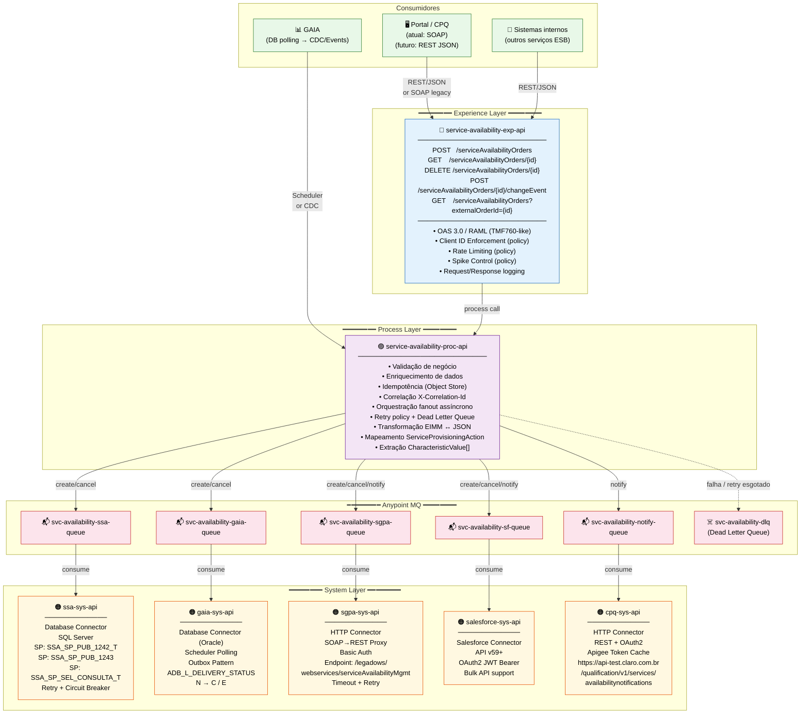
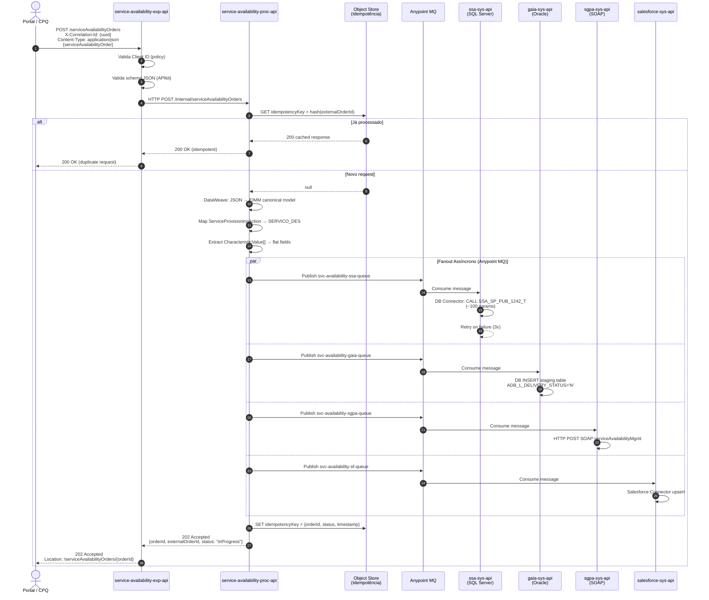
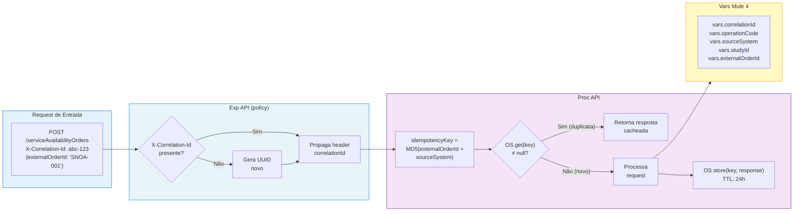
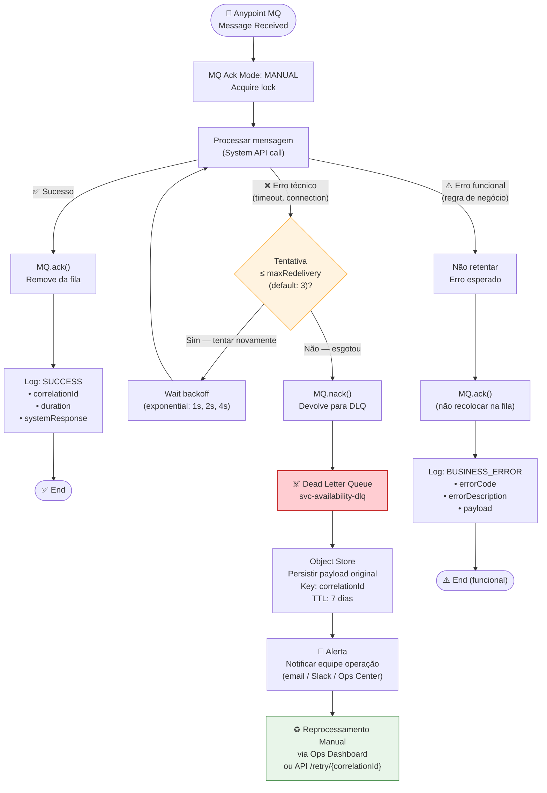
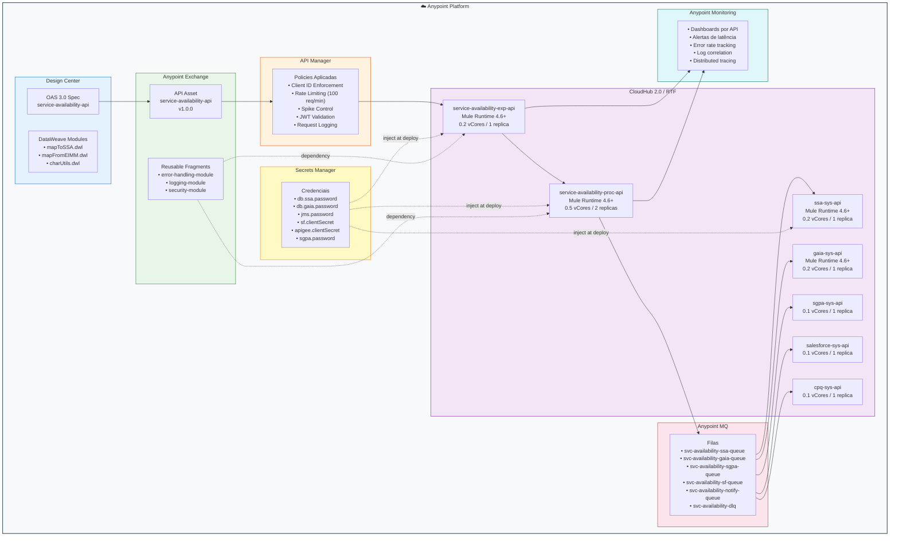
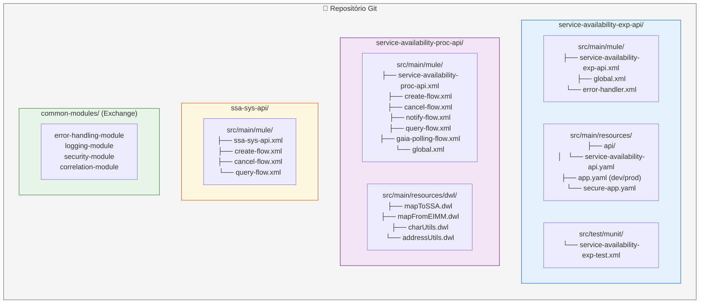
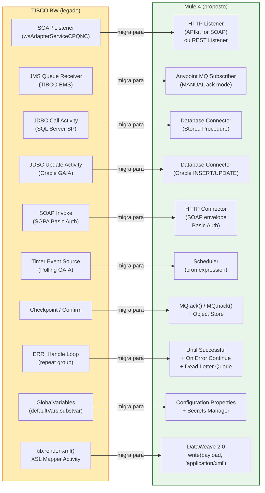
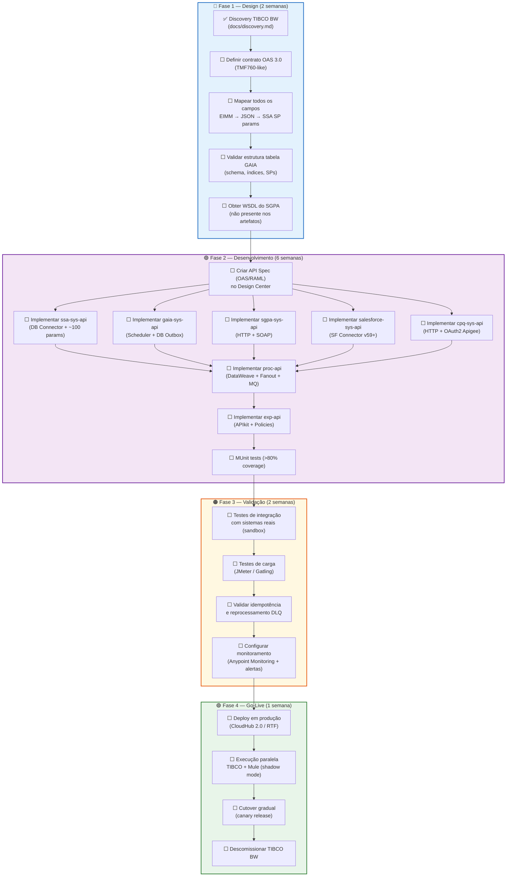

# Arquitetura Proposta — Mule 4 (Migração de SERVICE_AVALABILITY_MGMT)

> Diagramas Mermaid — renderizáveis nativamente no GitHub.  
> Referência: https://docs.mulesoft.com/general/ | TM Forum TMF760 Service Qualification

---

## 1. Visão Geral — API-Led Connectivity (3 Camadas)

---

## 2. Fluxo de Criação — `POST /serviceAvailabilityOrders`

---

## 3. Padrão de Idempotência e Correlação

---

## 4. Tratamento de Erros — Mule 4 (DLQ + Redelivery)

---

## 5. Componentes Anypoint Platform

---

## 6. Estrutura de Projetos Mule 4

---

## 7. Mapeamento TIBCO BW → Mule 4

---

## 8. Checklist de Migração

---

## Referências

- [MuleSoft Documentation](https://docs.mulesoft.com/general/)
- [TM Forum TMF760 — Service Qualification API](https://www.tmforum.org/resources/specification/tmf760-service-qualification-api-rest-specification-r19-0-0/)
- [TM Forum TMF641 — Service Ordering API](https://www.tmforum.org/resources/specification/tmf641-service-ordering-management-api-rest-specification/)
- [Mermaid Docs](https://mermaid.js.org/)
