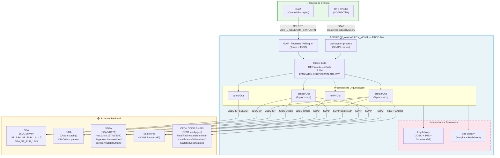

# SERVICE_AVAILABILITY_MGMT — Arquitetura TIBCO BW

## Legenda

| Símbolo | Descrição |
|---------|-----------|
| 🔵 | Canais de entrada (CPQ, GAIA) |
| ⚙️ | Motor de integração (TIBCO BW) |
| 🟢 | Sistemas backend |

## Componentes Principais

### Entrada
- **CPQ / Portal**: Interface SOAP para criar/cancelar/notificar/consultar ordens
- **GAIA**: Polling periódico em tabela Oracle de staging

### TIBCO BW
- **SOAP Listener** (`wsAdapter*.process`): Recebe requisições SOAP do CPQ
- **GAIA Polling** (`GAIA_Requests_Polling_In`): Timer + JDBC para monitorar staging
- **TIBCO EMS**: Message broker com 14 filas dedicadas (EMBRATEL.SERVICEAVALABILITY.*)
- **Orquestração**: 4 fluxos principais (create, cancel, notify, query)
- **Infraestrutura**: Log Library + Error Library (padrão Hospital + Redelivery)

### Backend
- **SSA**: SQL Server com stored procedures (1242 = create, 1243 = cancel)
- **GAIA**: Oracle staging com padrão Outbox
- **SGPA**: SOAP legacy com autenticação Basic Auth
- **Salesforce**: SOAP Partner API v30
- **CPQ/CDIGP/MPIS**: REST via Apigee com OAuth2

## Fluxos de Dados

| Operação | Destinos |
|----------|----------|
| `create` | SSA, GAIA, SGPA, SF, CPQ (9 processos) |
| `cancel` | SSA, GAIA, SGPA, SF (6 processos) |
| `notify` | SGPA, SF |
| `query` | SSA (SELECT via SP) |
